# ¿Cómo ajustar las longitudes de enlace de los puentes C<sub>2</sub>H<sub>6</sub>?

Este programa calcula las coordenadas de cada transición entre dos moléculas tricatiónicas (SP2 y SP3) al instanciar un objeto Molecule al cual nos referiremos en este documento como ${\Delta}M$. Esta molécula contiene las diferencias de coordenadas entre las moléculas $M_{SP2}$ y $M_{SP3}$ divididas por el número de transiciones deseadas. De esta forma, podemos decir que:

$$ {\Delta}M = \frac{M_{SP2} - M_{SP3}}{n} $$
$$ M_{SP2} = M_{SP3} + ({\Delta}M \cdot n) $$

Donde:

- $n$ = número de transiciones

El algoritmo usado para calcular las coordenadas de cada transición puede ser descrito a grandes rasgos de la siguiente manera:

```python
def generar_transiciones(nombre_molecula, numero_transiciones):
    sp3_m = Molecule(nombre_molecula + '_sp3')  
    sp2_m = Molecule(nombre_molecula + '_sp2')
    delta_m = (sp2_m - sp3_m)/numero_transiciones
    for n in range(1, numero_transiciones+1):  
        sp3_m += (delta_m * n)  
        sp3_m.guardar()
```

De esta forma, las coordenadas para cada transición son generadas y guardadas en archivos .gjf. A pesar de que este método funciona para conocer la trayectoria de cada átomo en la transición, no garantiza que la longitud de enlance se la correcta en cada paso intermedio, lo cual se puede observar en la siguiente tabla:

| | SP3 | Mitad de la transición | SP2 |
|-|-----|------------------------|-----|
|Molécula| 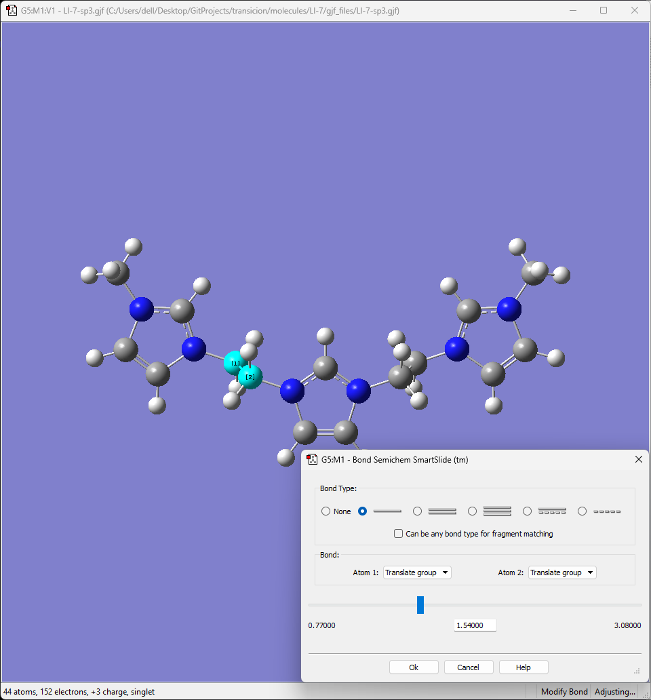 | 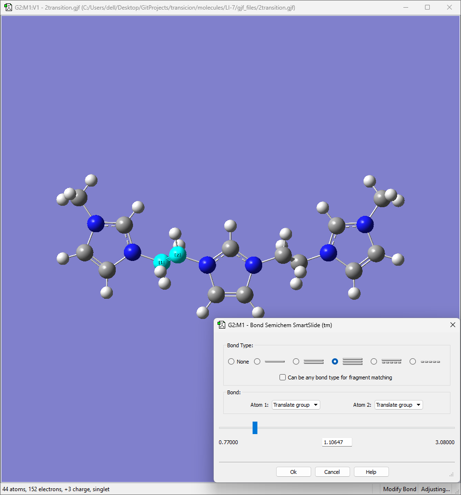 | 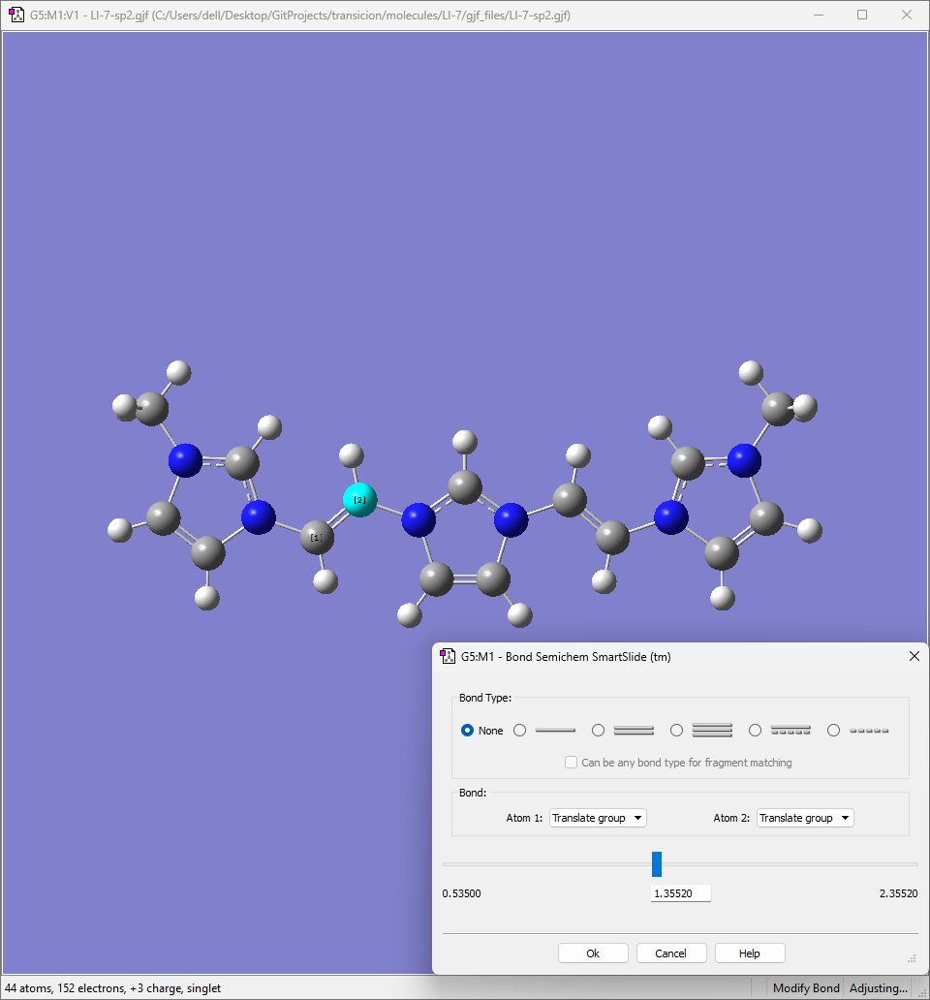 |
|Longitud del enlace C-C (Å)| 1.54 | 1.10647 | 1.3552 |

Como se puede observar, la longitud de enlace al aplicar este método no es la correcta, pues a la mitad de la transición se espera que la longitud de enlace C-C sea aproximadamente $L_{C-C}$:

$$ L_{C-C} = \frac{1.54 + 1.3552}{2} = 1.4476 $$

Esto se debe a que la trayectoria del átomo en este caso es una línea recta dada por el vector $\vec{v}_{19}*n | \vec{v}_{19} \in \Delta M$, el cual sería la diferencia del átomo en la posición 19 en estado SP2 y el átomo en la posición 19 en estado SP3.

| Átomo 19 en SP3 | Átomo 19 en SP2 |
|------------------|------------------|
| 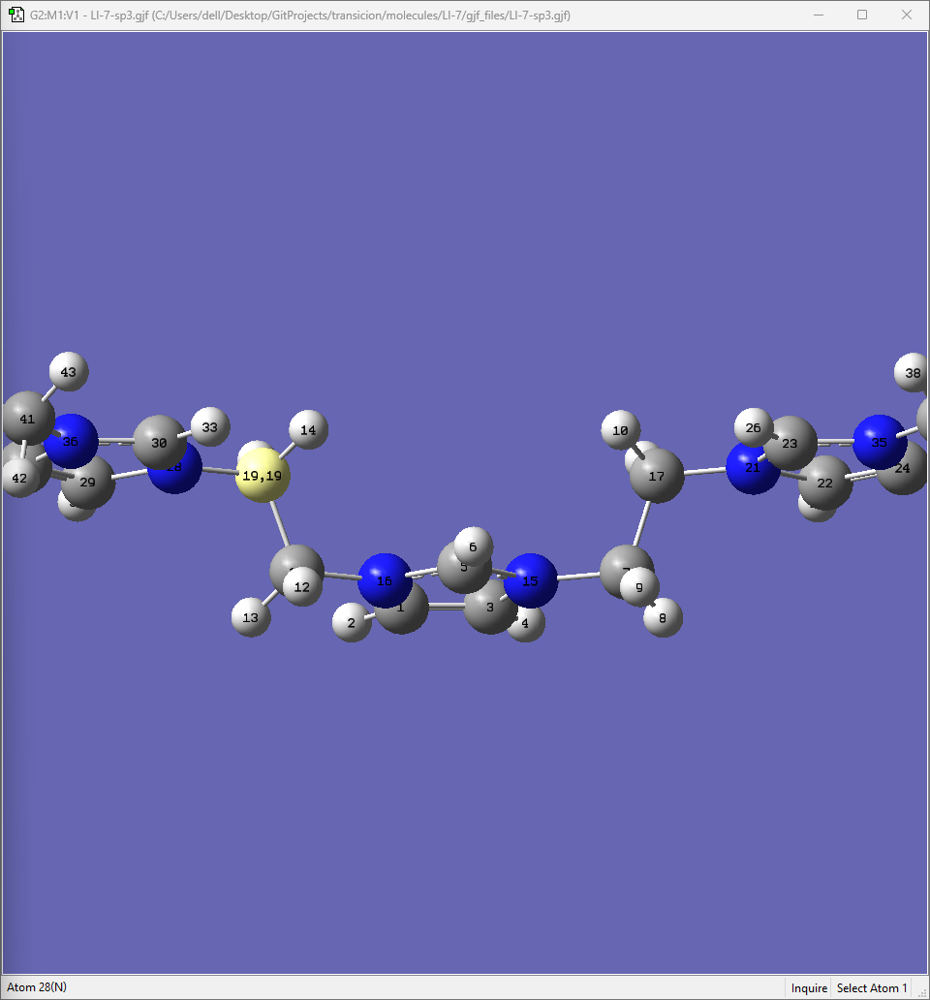 | 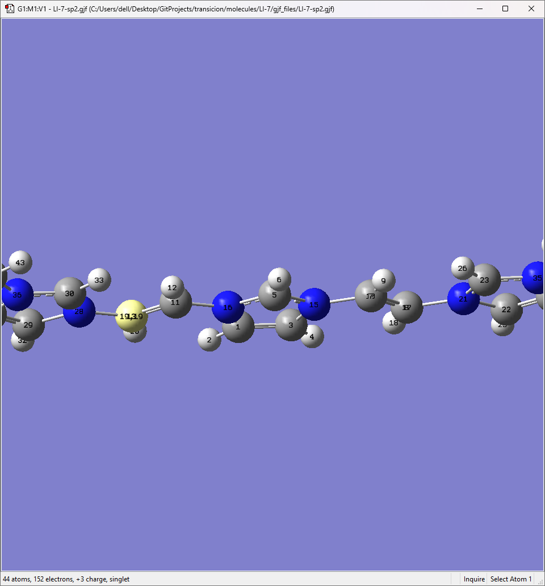 |

Los vectores anteriormente mencionados graficados en un espacio tridimensional son:

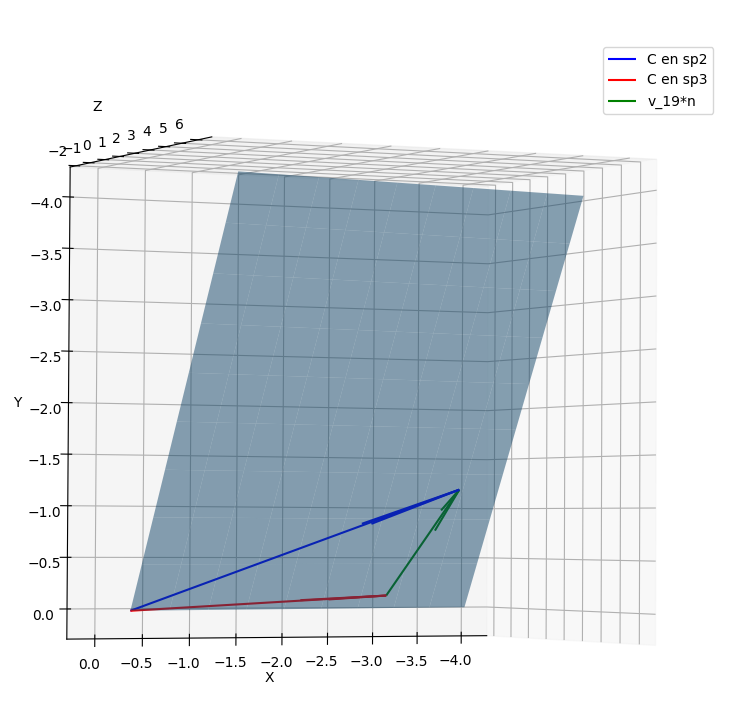

Es justamente esta trayectoria la que impide que la longitud sea la correcta, pues hace falta tomar en cuenta un componente más de la dirección de movimiento del átomo. Esta componenete adicional está dada por la diferencia entre el átomo $v_{11}$ y el átomo $v_{19}$ en la iésima transición, el cual es el vector que representa el enlace C-C en cada transición. De esta forma, la trayectoria del átomo 19 estaría dada por:

| Componente adicional a mitad de la transición |
|------------------|
|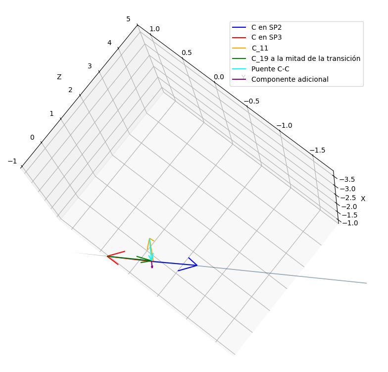|

Como se puede visualizar, el componente adicional (vector rojo) sigue la misma dirección que el vector del enlace C-C (vector rosa), pues este componente adicional ajusta la distancia del puente C-C para que sea la correcta en cada transición. En este caso:

$$||Puente\_C-C + Componente\_adicional|| = 1.4476 $$

De esta manera se soluciona el problema de la longitud de enlace, pues al tomar en cuenta este componente adicional se garantiza que la longitud de los enlaces en los puentes $C_2H_6$ sean las correctas en cada transición.

## ¿Cómo encontrar la nueva componente?

En este caso, nos concentraremos en el método para encontrar la nueva componente con respecto al átomo $C_1$ del puente izquierdo de la molécula LI-7; este átomo tiene el índice 19. Para una mejor explicación del método general para encontrar la nueva componente, viusalizaremos el plano que pasa por los vectores C en SP3, C en SP2, el vector de transición y el origen; se toma el vector unitario de C en SP3 (i.e. el vector rojo) como el vector $\hat{\textbf{\i}}$ del plano.

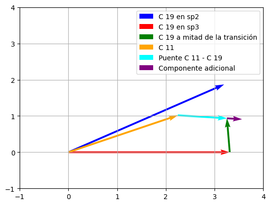

Vale la pena recordar que los vectores C 11(vector naranja), puente C-C (vector cyan) y Componente adicional (vector púrpura) sobresalen del plano y en este caso se representan como una proyección sobre el plano. A continuación añadiremos los vectores $v$ y $v'$, los cuales también sobresalen del plano, ya que comienzan en el átomo estacionario.

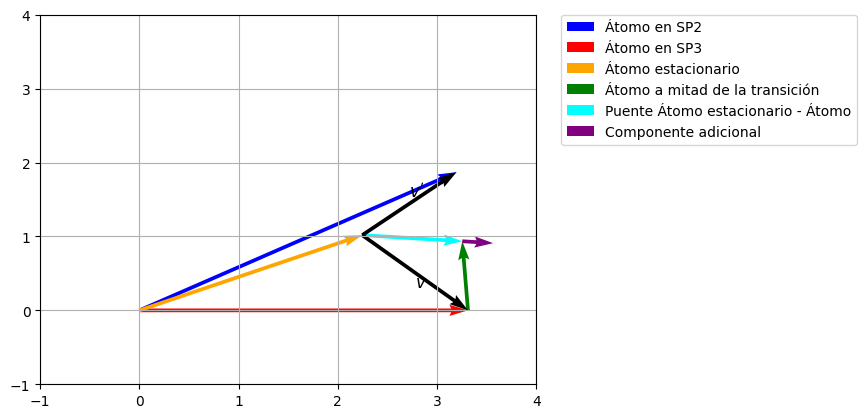

Ahora dejaremos los vectores C en SP3, C en SP2 y C 11 representados como puntos para concentrarnos en los demás vectores:

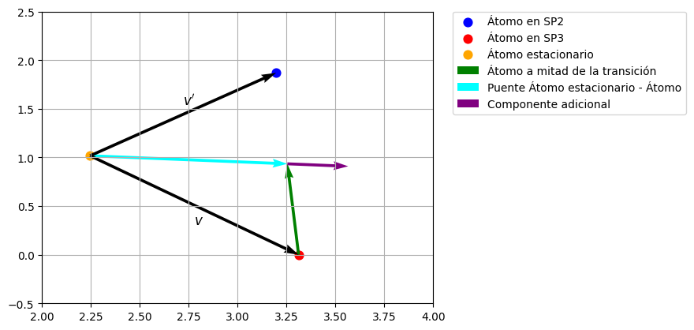

Basándonos en la imagen anterior, renomraremos los vectores de la siguiente manera:

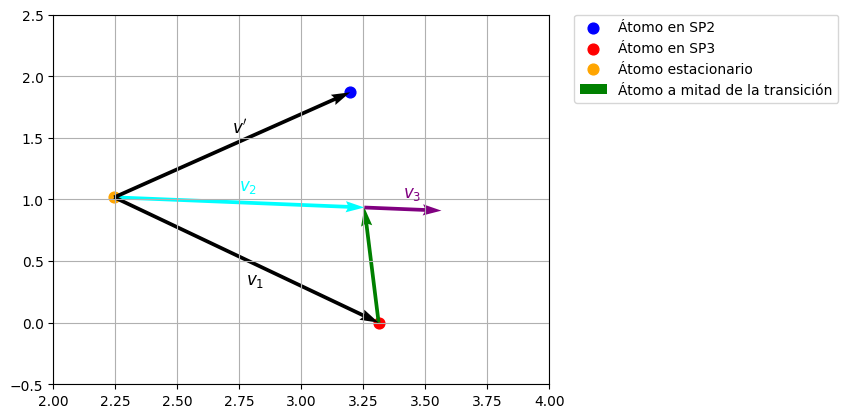

Tomando en cuenta el planteamiento anterior, estableceremos que:

$$ \Delta r = \frac{||v'|| - ||v_1||}{n} $$

Donde:
- $n$: Es el número total de pasos en la transición.

Por lo tanto:

$$ ||v_2|| + ||v_3|| = ||v_1|| + \Delta r \cdot i $$

Donde:
- $i$: Es el número de paso actual. En este caso, si $n = 2$ (i.e. un paso a la mitad de la transición y otro en sp2) y estamos en la mitad de la transición, entonces $i = 1$.

Elaborando un poco más la ecuación anterior, podemos decir que:

$$
\begin{align*}
||v_2|| + ||v_3|| &= ||v_1|| + \Delta r \cdot i \\
||v_3|| &= ||v_1|| - ||v_2|| + \Delta r \cdot i \\
\end{align*}
$$

Ya que $v_3$ es una forma escalada de $v_2$, podemos decir que:

$$ 
\begin{align*}
v_3 &= \frac{v_2}{||v_2||} \cdot ||v_3|| \\
v_3 &= \frac{v_2}{||v_2||} \left(||v_1|| - ||v_2|| + \Delta r \cdot i\right)
\end{align*}
$$

## Generalización del método para encontrar $v_3$ respecto a todos los átomos del puente

Analizaremos la transición del puente izquierdo $C_2H_6$ de la molécula LI-7 para saber qué átomos del puente necesitan esta componente adicional.

| SP3 | SP2 |
|-----|-----|
|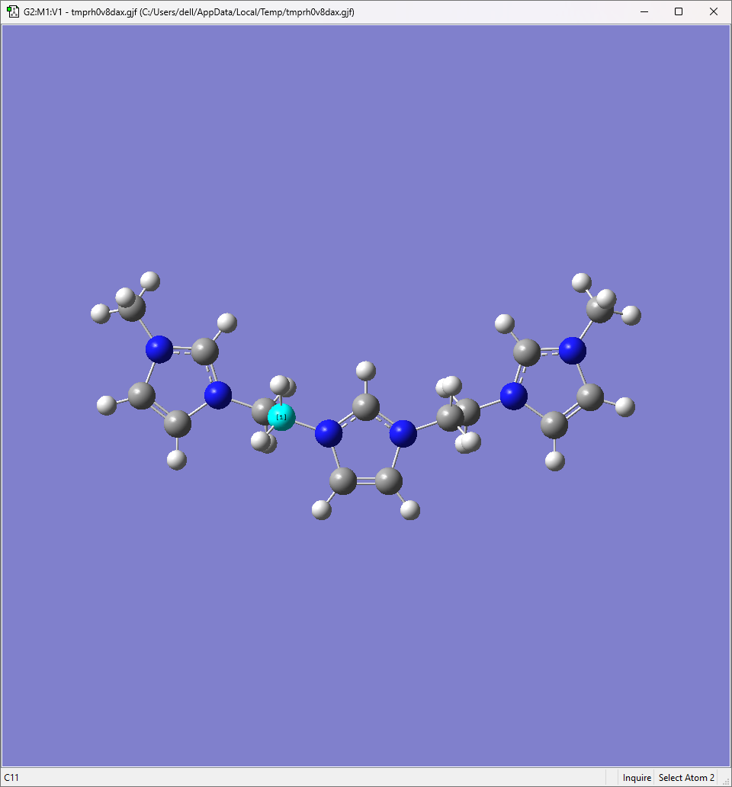 | 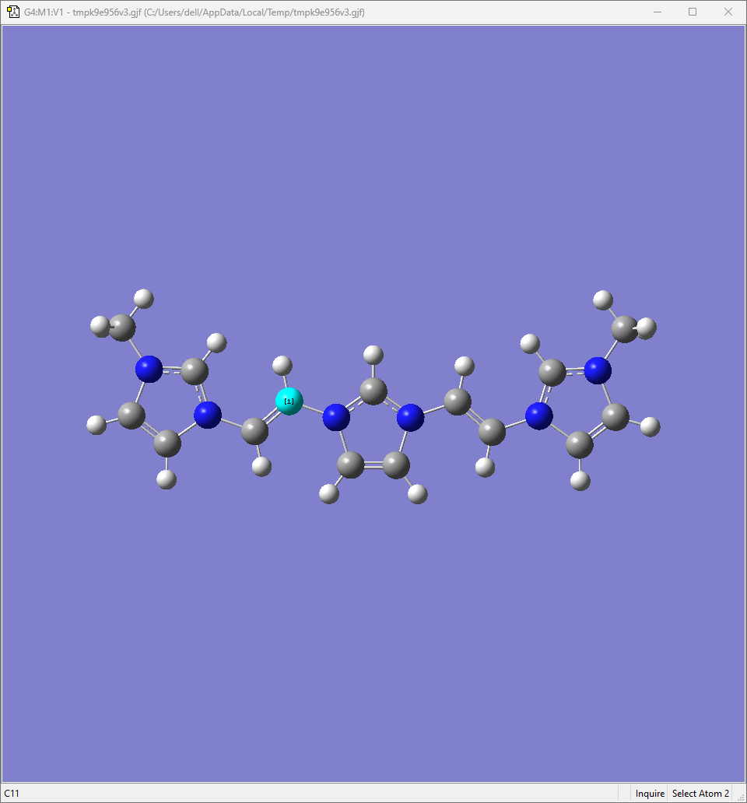 |

Como se puede observar, el átomo C señalado es el único que no se moverá (átomo estacionario), por lo que todos los demás necesitan esta componente adicional para ajustar la longitud de enlace.

Ahora nombraremos los átomos del puente de la siguiente manera para una mejor explicación del método:

|Átomos inferiores|Átomos superiores|
|------------------|------------------|
|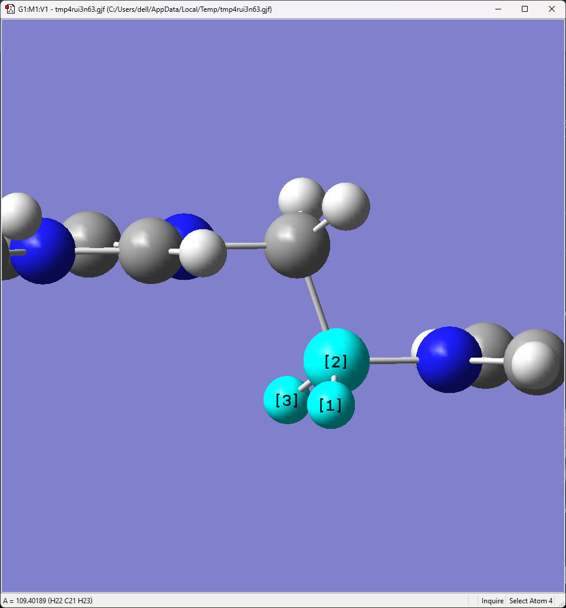 | 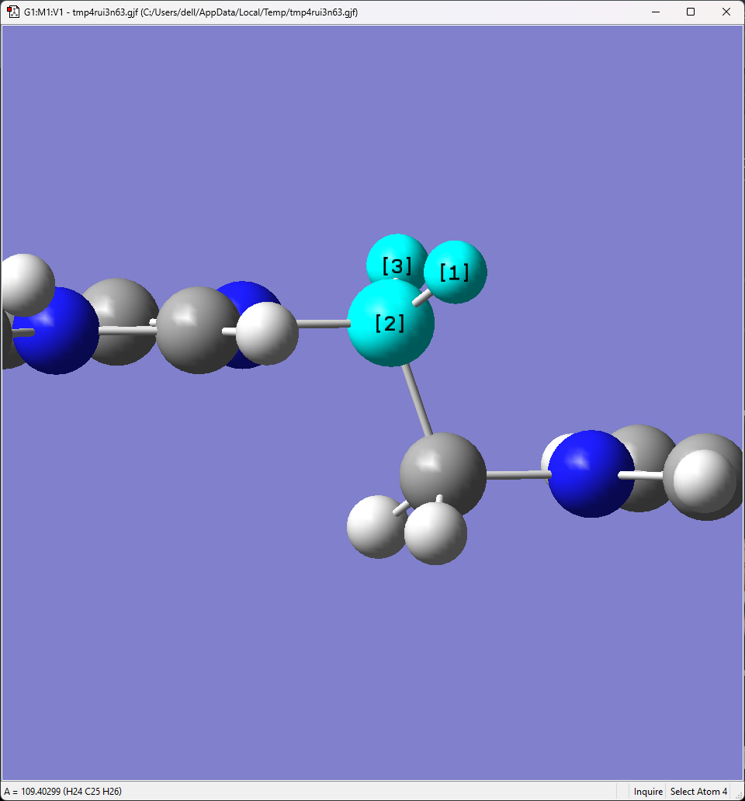 |

### Átomos inferiores
Los átomos de la parte inferior del puente serán nombrados de la siguiente manera:

- [1] : $a_0$
- [2] : $c_0$
- [3] : $b_0$

A partir de esto, podemos encontrar el vector $v_1$ correspondiente a $a_0$ y $b_0$ tomando a $c_0$ como el átomo estacionario, por lo que si $x \in \{a_0, b_0\}$:

$$v_{1x} = x - c_0$$

### Átomos superiores
Los átomos de la parte superior del puente serán nombrados de la siguiente manera:

- [1] : $b_1$
- [2] : $c_1$
- [3] : $a_1$

Si $x \in \{a, b\}$, entonces $x_0$ es simétrico a $x_1$ con respecto al átomo $c$ con el que está enlazado, por lo que:

$$
\begin{align*}
a_1 &= c_1 - v_{1a_0} \\
b_1 &= c_1 - v_{1b_0}
\end{align*}
$$

O dicho de otra forma, si $x \in \{a, b\}$:

$$ x_1 = c_1 - v_{1x_0} $$

Si reemplazamos $v_{1x_0}$ con $(x_0 - c_0)$, entonces:

$$ x_1 = c_1 -  (x_0 - c_0)$$


### Átomos que cambiarán de posición
En resumen, los átomos del puente $C_2H_6$ que cambiarán de posición durante la transición son:

- $a_0$ y $b_0$ en la parte inferior del puente.
- $c_1$, $a_1$ y $b_1$ en la parte superior del puente.

Pero ya que $a_1$ y $b_1$ pueden ser definidos por $a_0$ y $b_0$ respectivamente al encontrar $c_1$, entonces los átomos cuya componente adicional debe ser calculada son:

- $c_1$
- $a_0$
- $b_0$

### Cálculo de la nueva componente para $c_1$, $a_0$ y $b_0$
Partiendo de la ecuación para encontrar $v_3$:

$$ v_3 = \frac{v_2}{||v_2||} \left(||v_1|| - ||v_2|| + \Delta r \cdot i\right) $$

Sabemos que necesitamos conocer $v_1$ (descrito anteriormente), $v_2$ y $\Delta r$ para encontrar $v_3$. Si $x \in \{c_1, a_0, b_0\}$:

- $v_{1x} = x - c_0$ dada la posición de $x$ en el paso 1
- $v_{2x} = x - c_0$ dada la posición de $x$ en el iésimo paso
- $\Delta r = \frac{||v'_{x}|| - ||v_{1x}||}{n}$, donde $v'_{x}$ es la posición de $x$ en el estado SP2

## Descripción de cada átomo después de la correción de la longitud de enlace

## ¿Cómo encontrar el componente adicional de forma computacional?

Partiendo del algoritmo para generar las transiciones que se encuentra al inicio de este documento, se usa la el método **adjust_bridges()** perteneciente al objeto generador de clase Transitions. Este método crea una copia de la molécula en el iésimo paso de la Transición y regresa esa copia con las longitudes de enlace de los puentes ajustadas:

```python
def generar_transiciones(nombre_molecula, numero_transiciones):
    sp3_m = Molecule(nombre_molecula + '_sp3')  
    sp2_m = Molecule(nombre_molecula + '_sp2')
    delta_m = (sp2_m - sp3_m)/numero_transiciones
    for n in range(1, numero_transiciones+1):  
        sp3_m += (delta_m * n)
        adjusted_molecule = self.adjust_bridges(n, indexes_dictionaries, bridges_data)
        adjusted_molecule.show_gjf(self.header_file)
```